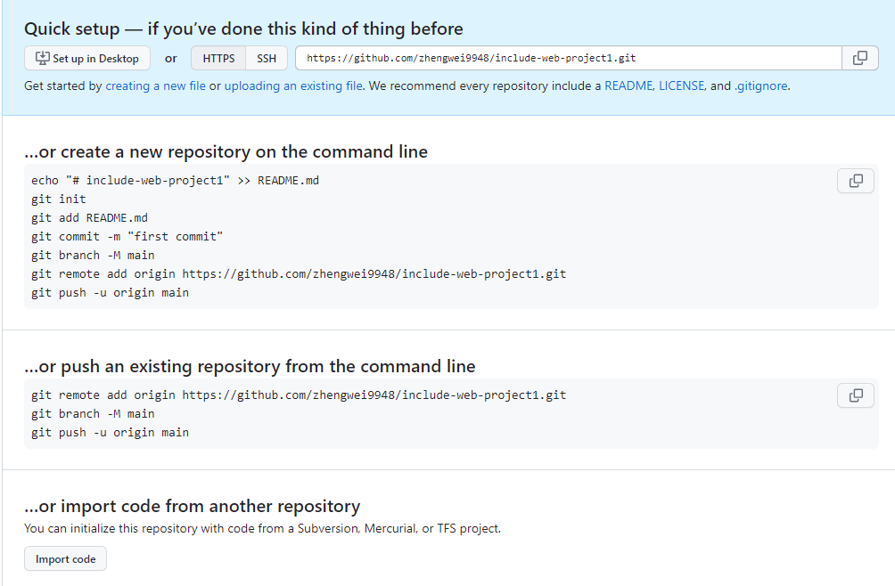
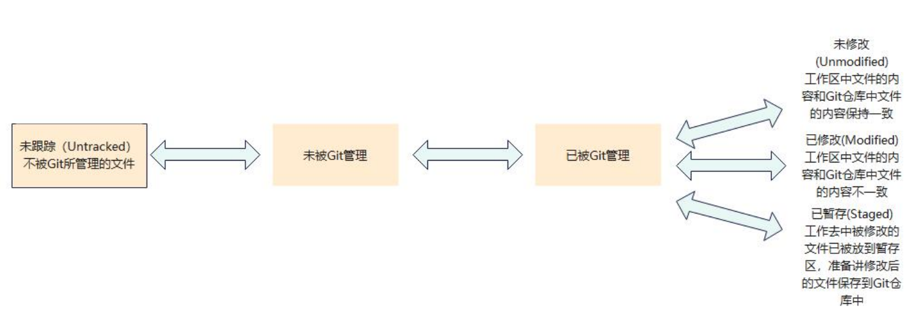

# include-web-project1

This template should help get you started developing with Vue 3 in Vite.

## Recommended IDE Setup

[VSCode](https://code.visualstudio.com/) + [Volar](https://marketplace.visualstudio.com/items?itemName=Vue.volar) (and disable Vetur) + [TypeScript Vue Plugin (Volar)](https://marketplace.visualstudio.com/items?itemName=Vue.vscode-typescript-vue-plugin).

## Customize configuration

See [Vite Configuration Reference](https://vitejs.dev/config/).

## Project Setup

```sh
npm install
```

### Compile and Hot-Reload for Development

```sh
npm run dev
```

### Compile and Minify for Production

```sh
npm run build
```
# .md文件可以导出html文件
方便WEB直接加载，对于展示网页说明文档，非常方便，
不用编写网页，直接编写md文件，然后导出给vue等用
# git使用
```
官网
https://git-scm.com/
https://git-scm.com/downloads
https://git-scm.com/docs/git
```
## git init  
```
初始化分布式本地仓库,通过vue脚手架创建的项目是没有初始化本地仓库的，需要执行此命令操作
1.获取 Git 仓库的两种方式
  将尚未进行版本控制的本地目录转换为 Git 仓库。
  从其它服务器克隆一个已存在的 Git 仓库。
  以上两种方式都能够在自己的电脑上得到一个可用的 Git 仓库。
2.在现有目录中初始化仓库
  如果自己有一个尚未进行版本控制的项目目录，想要用 Git 来控制它，需要执行如下两个步骤：
　　第一：在项目目录中，通过鼠标右键打开 Git Bash 窗口，或者直接在VSCODE终端中打开命口
　　第二：执行 git init 命令将当前的目录转换为 Git 仓库。
　　git init 命令会创建一个名为.git 的隐藏目录，这个.git 目录就是当前项目的Git仓
　　库，里面包含了初始的必要文件，这些文件是 Git 仓库的必要组成部分。
　　初始化完成后，会在项目文件夹下多了一个.git 目录

```
## git status
```
检查文件的状态
使用 git status 输出的状态报告很详细，但有点繁琐。如果希望以精简的方式显示文件的状态，可以使用如下两条完全等价的命令，其中-s 是--short 的简写形式。
精简的方式显示文件状态命令：
git status -s 或 git status --short
两个红色的问号表示未跟踪的文件
```
## git add . 
``` 
将所有文件加入管理
git add . 表示跟踪所有文件
git add index.html 表示只跟踪index.html一个文件
```
## git commit -m "1st zw" 
```
git commit -m "1st zw" 提交版本记录
git commit 命令进行提交，其中-m 选项后面是本次的提交消息，用来对提交的内容左进一步的描述

```
## git remot 本地仓库上传到远程仓库

```
 git branch        查看本地分支
 git branch -r     查看远程分支
 git branch -a     查看本地+远程分支

【1】git remote add origin https://github.com/zhengwei9948/include-web-project1.git 
将本地仓库中的内容推送到远程的 origin 仓库中。
如果出现此错误 fatal:remote origin already exists，输入以下命令即可。
git remote rm origin


【2】git branch -M main 将默认分支从”master”改名为”main”,一般不用重命名，保持默认的master就行
https://deepinout.com/git/git-questions/181_git_what_does_the_m_mean_in_git_branch_m_main.html

【3】git push -u origin main：将本地仓库推送到被重命名后的远程仓库中。
如果报错：fatal:unable to access 'https://github.com/....'
解决办法：git config --global https.sslVerify "false" 输入 git push -u origin main 命令，会弹出一个登录的窗口，只需要输入 github 对
应的用户名和密码即可完成将代码托管到 github 创建的仓库中


```
## git remote -v
```
查看远程仓库列表
git remote show origin
除了列表信息外，还可以通过Git命令查看所有远程仓库的详细信息，包括它们的名称、URL地址、fetch和push的分支以及其他配置信息

```
## git --version
```
查看Git版本
```
## git config --list --global
```
查看所有的全局配置项
查看指定的全局配置项：
git config user.name
git config user.email
```
## 设置git　用户名与邮箱
```
git config --global user.name “zhengwei”
git config --global user.email “913197160@qq.com”
```
## 工作区中文件的 4 种状态
```
工作区中的每一个文件可能有 4 种状态，这四种状态共分为两大类，如图所示：
```


## 错误解决
```
warning: in the working copy of 'index.html', LF will be replaced by CRLF the next time Git touches it
解决命令： git config --global core.autocrlf false
```

## 查看提交历史
```
【1】按照时间先后顺序列出所有的提交历史，最近的提交排在最上面：$ git log
【2】只展示最新的两条提交历史，数字可以按需进行填写：$ git log -2
【3】在一行上展示最近两条提交历史的信息：$ git log -2 --pretty=oneline
【4】在一行上展示最近两条提交历史的信息，并自定义输出的格式，如下：
 %h：表示提交简写的哈希值。
 %an：作者名字
 %ar:作者修订日期，按多久以前的方式显示
 %s:提交说明
 命令：$ git log -2 --pretty=format:“ %h | %an | %ar | %s ”
 注意自定义格式中有双引号
```
## 回退到指定版本
```
【1】使用 git reset --hard 命令，根据指定的提交 id 回退到指定的版本：
     git reset --hard <CommitId>

【2】当操作了以上命令切回到旧版本后，还想展示所有的历史，就需要使用以下命令：
     git reflog --pretty=oneline
     然后再根据最新的提交 Id，跳转到最新的版本即可

```


